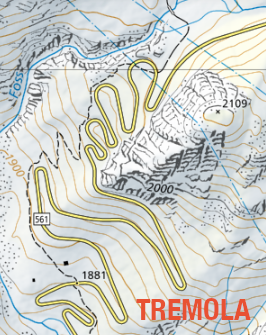

# Tremola README

Tremola is a [Secure Scuttlebutt (SSB)](https://scuttlebutt.nz/)
client for Android that only supports private chat.

Tremola aims at having the same functionality as other end-to-end encrypted
messenger applications like Signal, Whatsapp or Threema but works in a
decentralized way. Why is this important?

## Fully Decentralized: no need for Facebook's or Signal's servers to service you

The big difference and asset over traditional end-to-end encrypted
messengers is that Tremola follows SSB's decentralized approach of
permissionless and trustless operations. Permissionless means that
using Tremola does not depend on services provided by others (which
could be turned off for you or a whole country): two Tremola-enabled
smartphones can work locally even when on an island, so to
speak. Trustless means that no trust is needed in auxiliary
connectivity services, should you choose to use them.

## Easy Onboarding via QR codes

Having a fully decenctralized messenger comes at a price: there is no
global user directory and you must know another person's cryptographic
identity beforehand, which is also known as the onboarding problem:
how can you contact a peer if the peer does not know that you want to
contact them nor knows your cryptographic identity? As a comparison:
In case of Signal, your device's phone number is used as an identifier
and Signal's servers keep track of these numbers and do the match
making, while in Threema, the Threema service assigns short names on
sign-up and manages them for you, also permitting you to establish
contact through them if you know the peer's shortname.

Tremola solves the onboarding problem in the same way Threema
works: two peers should -for trust reasons- better meet in physical
space and scan a QR code on each other's smartphone to do the
bonding. It is also planned that Tremola will offer a "secure wireless
pairing mode" that works exactly like pairing two Bluetooth devices.

The following video shows the Tremola onboarding experience for Alice
and Bob who just met in a bar and want to establish a trusted SSB
channel they can use in the future. The video also shows that they can
immediately test their channel via local WiFi.

[Onboarding demo (video)](doc/qr-onboarding-demo.mov)

## Proof-of-Concept and Experimentation Vehicle

Tremola is a first step towards turning SSB into a true competitor
to established end-to-end encrypted messengers. On this journey,
Tremola currently serves as experimentation platform both for the
apps's software architecture as well as the way SSB data is handled:

- The core of SSB, namely the replication protocol and wire format, is programmed in the Kotlin language while user interface aspects and rendering is delegated to Android's WebKit module and some JavaScript (instead of hardwiring also these aspects in Kotlin).

- Tremola will follow a "surf approach" that focuses on the novelty wavefront, keeping only recent messages instead of the full history which can become quite large in SSB. This is made so that smartphones can quickly get into messaging even with peers that have accumulated a huge "append-only log".

- Tremola currently has a very limited form of secure group communications that is inherited from SSB's current protocol (limit of 7 participants, no dynamic group membership). Implementing SSB's new secure group communication protocol will be a natural evolution step for Tremola.

## Why the name "Tremola"?

Crossing the Swiss alps for centuries passed through "Val Tremola",
a valley on the north-south connection over the Gotthard pass. The
street with the same Name still exists and is well-known for its
adventurous hairpin curves. We envisage that the Tremola app also
will have to do several turns until it reaches its peak.

---

